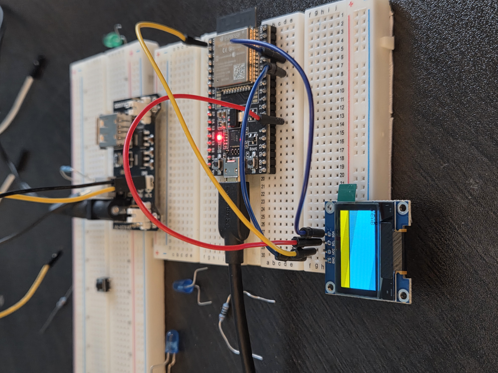
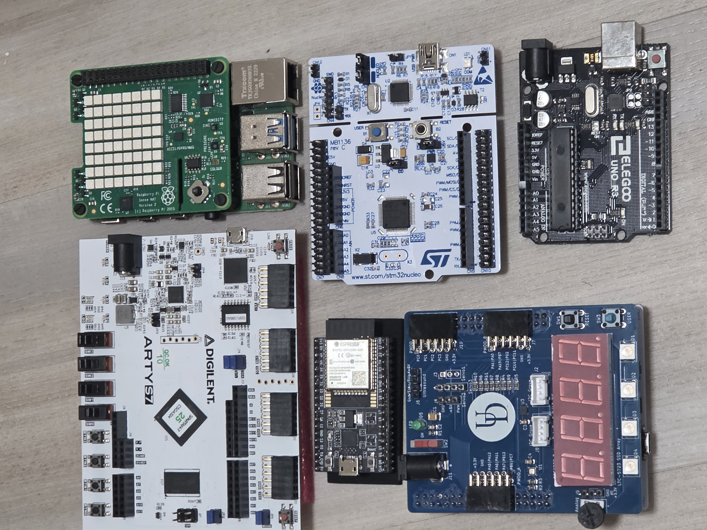
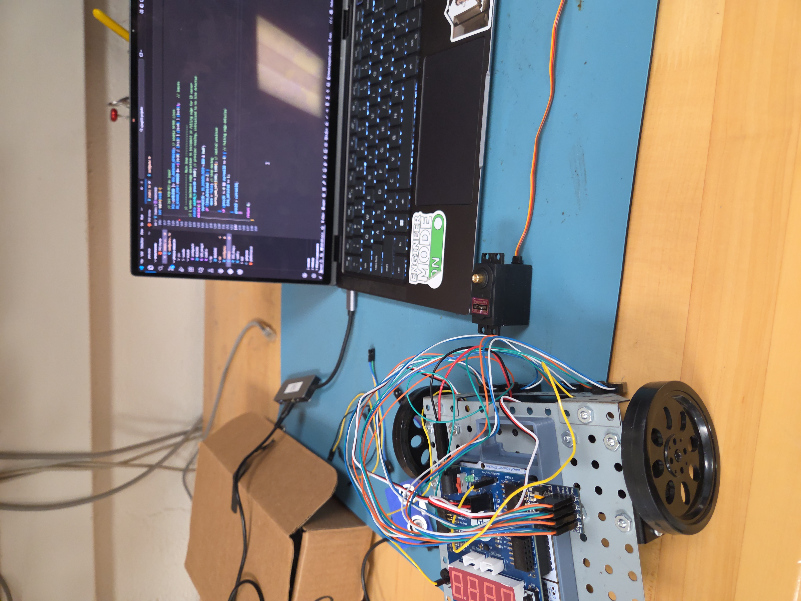

## Welcome to my engineering portfolio, here are my top embedded systems projects!
Hello!

My name is Nicholas West, and I am a third-year Computer Engineering student at the University of Delaware with a strong interest in embedded systems engineering. My interests are working across the full embedded stack, from low-level firmware development & bare-metal programming to designing/prototyping the hardware.

  Through my coursework at UD, I have built a solid foundation in microcontrollers, digital & analog circuits, bare-metal programming, engineering math, and computer science. I build off of this experience through my independent, hands-on projects, where I focus on designing, implementing, and debugging real embedded systems.
  
  This portfolio highlights my favorite projects and documents my engineering process, including system design decisions, low-level implementation details, debugging strategies, and what each project taught me.

  > Here is a mini table-of-contents of my portfolio projects at a glance. I build off of each skill in every project, so for each I will list key skills learned:
> - Line-Follow Robot: Autonomous development, ADC/DAC, Nested Vectored Interrupt Controller (NVIC), pulse-wdith modulation (PWM), advanced sensor feedback
> - Ultrasonic Radar System: Embedded C, UART, Interrupt Service Routines, timers, GPIO configs, registers access and control, software debouncing
> - Environment Sensor: I2C, controlling multiple sensors & NeoPixels, Arduino framework
> - Pocket To-Do List: I2C, controlling OLED Display, PCB prototyping
  

Please feel free to reach out to me at npwest@udel.edu with any questions about my background, projects, or technical experience. Thank you for your time, and I hope you find these projects as interesting as I do!

Thanks,  
Nick

  
