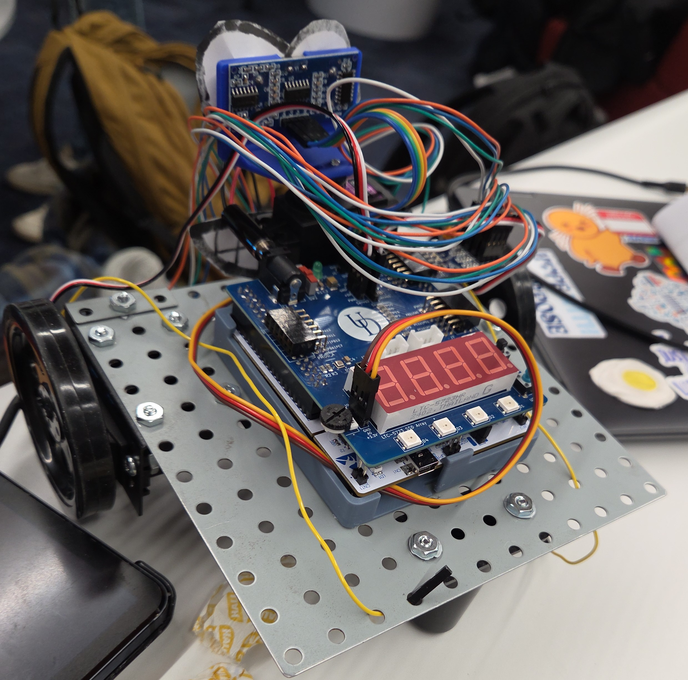
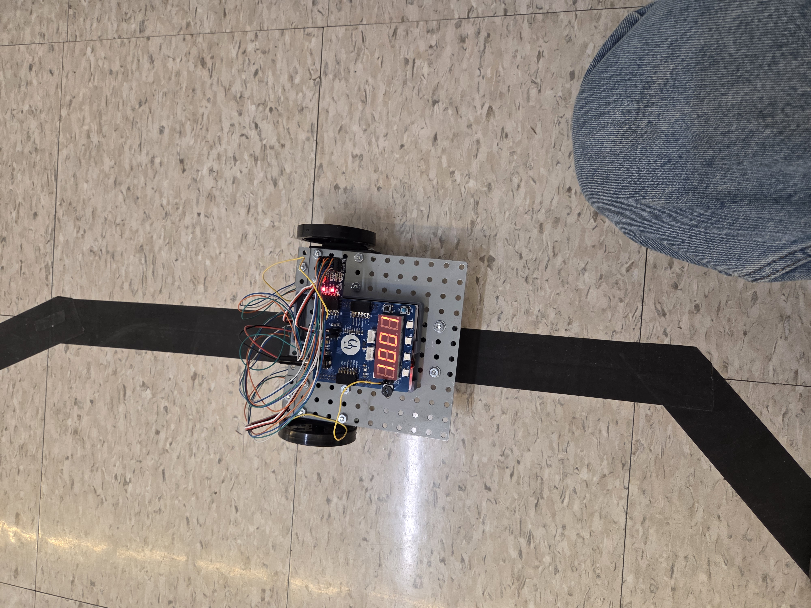

# Autonomous Line-Following Robot
## Description: 
Line-Following Robot for the final project in my microcontroller class. We were tasked to design a robot that could follow a line using a set of infrared sensors and motors. Other requirements were to record the time on the Seven-Segment display and to use the ultrasonic sensor to park between obstacles at the end of the race.

*my source code can be found in line-follow-robot/src/*
## Tech Used:
- MCU: STM32F446RE
- IDE: VSCode w/ PlatformIO
- Motors: Parallax Continuous Rotation, 360°
- Other: IR sensors w/ module, Ultrasonic Sensor, Seven-Segment Display
## New Skills Learned:
- More advanced use of timers and interrupt routines
- Controlling motors using pulse-width modulation, and how to implement in bare-metal
- Autonomous component: robot needed to make decisions without intervention or our input, so all routines had to be rigorously tested
- Controlling multiple peripherals simultaneously
## Challenges & Difficulties: 
The trickiest part was designing ISR’s that were able to handle all the turns & angles of the course, as shown below. We solved this by triggering different routines based on which of the four IR sensors were activated. Another challenge was getting the Ultrasonic sensor to work, which required a lot of debugging and trial-and-error.
## Result:
Success! Our robot was one of the top race finalists, and I am happy how all of our code/peripherals came together. This project was a lot of fun to work on, and I am proud of the end result. Project recieved full credit from instructors, as well as additional bonus credits for meeting special criteria.

